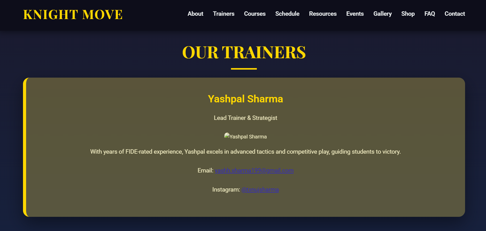
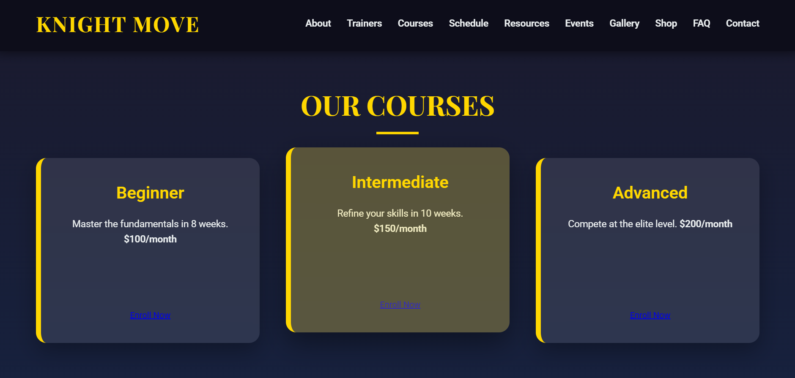

# ♟️ Knight Move Chess Academy

**Welcome to the official website of Knight Move Chess Academy** — a modern, elegant, and fully responsive platform designed to inspire, inform, and engage chess enthusiasts across the globe.


---

## 📖 Project Overview

This website serves as a virtual gateway for prospective students, parents, and chess enthusiasts. It combines rich content with modern design aesthetics to reflect the academy’s core values: excellence, strategy, and passion for the game.

---

## 🎨 Design & Aesthetics

- **Theme:** Black and Gold, symbolizing prestige and strategic brilliance
- **Typography:** `Playfair Display` for headings, `Roboto` for body text
- **Glassmorphism:** Cards with blur and transparency for a modern touch
- **Animations:** Scroll-triggered transitions, ripple button effects, and fade-ins for an engaging experience

---

## 📂 Sections

- **About Us**
- **Trainers**
- **Courses**
- **Schedule**
- **Resources**
- **Events**
- **Gallery**
- **Shop**
- **FAQ**
- **Contact**

---

## 🚀 Key Features

- **Responsive Design:** Mobile-first layout with Flexbox & Grid
- **Dynamic Hero Section:** Background image + fade-in CTA and tagline
- **Interactive UI:** Hover effects, scroll animations, ripple buttons
- **Modular Code:** Reusable components, clean structure, scalable
- **Planned Enhancements:** Chatbot, backend integration, SEO optimization

---

## 🛠️ Tech Stack

- **HTML5:** Semantic structure and accessibility
- **CSS3:** Gradients, glassmorphism, keyframe animations, transitions
- **JavaScript:** Menu toggle, scroll animations (planned: Intersection Observer)
- **Fonts & Icons:** Google Fonts, Font Awesome
- **Hosting:** GitHub Pages

---

## 📸 Screenshots

| Hero Section | Trainers | Courses |
|--------------|----------|---------|
|  |  |  |


---

## 📦 How to Use / Run Locally

```bash
git clone https://github.com/your-username/knight-move-chess-academy.git
cd knight-move-chess-academy
open index.html

-------------
 🌟 Planned Enhancements
 Live Chatbot (e.g., Tidio, Botpress)

 Backend Integration (Node.js/React)

 Student Dashboard & Progress Tracker

 Daily Puzzle / Mini Games

 SEO Improvements (alt tags, structured data)

🤝 Contributing
Pull requests are welcome! For major changes, please open an issue first to discuss your ideas.
This project is licensed under the MIT License — feel free to fork and customize with attribution.

🧑‍💻 Developed By
Yashpal Sharma
Lead Trainer & Developer at Knight Move Chess Academy
📧 yashh.sharma199@gmail.com
📸 Instagram: @txnujsharma

📢 Special Thanks
Thanks to the Knight Move team, students, and the chess community for inspiring this project.
